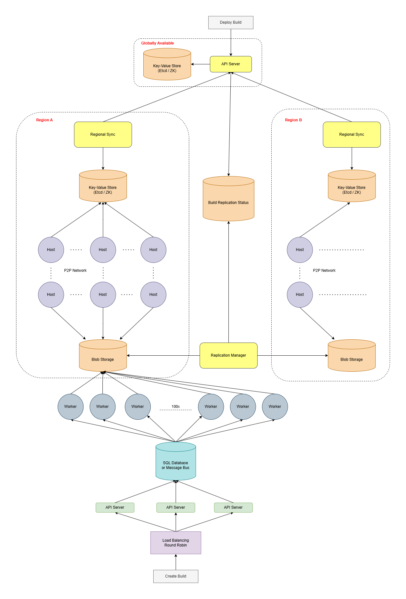

# Design A Code-Deployment System
## Gathering System Requirements
We are building a system that involves building and deploying code to hundreds of thousands of machines spread out across 5-10 regions around the world. The system will be designed to deploy repeatedly thousands of times per day.

Building code involves grabbing snapshots of the code using commit SHA identifiers. Beyond that, the actual implementation details are assumed to be taken cared of.

The technical details are not relevant to this design (JavaScript, C++, etc..). This design involves just the repeated building of code.

Building code will take around 15 minutes, and it will result in a binary file up to 10 GB. The entire deployment process involves building and deploying the code. And we want it to take at most 30 minutes.

Each build will end up in a terminal end-state. This would be either **Success** or **Failure**. And although availability is important, with 2 or 3 nines is enough. We don't need to optimize the system to be Highly Available.

## Coming Up With A Plan
What are the major, distinguishable components of our system?

The system will be very simple. It will be divided into two subsystems:
- **The Build System**: Which builds the code into binaries
- **The Deployment System**: Which deploys binaries to the machines across the world.

Each of the subsystems will have many components inside of them.

## Build System - General Overview
On a general view, the process of building code can be called a **job**. The build system can be designed as a queue of jobs.

Each job will have a SHA, which is the commit identifier for what version of the code it should build first. Every job will also have a **name**, which is the name of the artifact created / resulting binary.

As this is **language agnostic** of the type of code, all coding languages are handled here.

From the server side of the system, we can have a pool of servers (workers) which are going to handle the work. Each worker will:
1. take jobs out of the queue repeatedly in a FIFO manner.
2. Build the relevant binaries
3. Write the resulting binaries to a blob storage

Blob storages are preferred in this system, because binaries are blobs of data. We can use **Google Cloud Storage** or **S3** for instance.

## Build System - Job queue
As we cannot have the queue implemented in memory, because if there is a failure on the server, the system will lose the entire state of the jobs. We are better using an SQL table.

It's super important not to lose the queued jobs and past jobs, even on a power outage or server failure.

## Build System - SQL Job queue
We can make an SQL table called **jobs** on the DB, in which every record represents a job. We can also use the record-creation timestamps as the queue's ordering index.

Our table will look like this:
- id: string (The ID of the job, auto-generated)
- created_at: timestamp
- commit_sha: string
- name: string (A pointer to the job's binary in blob storage)
- status: enum('queued', 'running', 'succeeded', 'failed')

On the actual implementation, the system will select the record for the dequeuing mechanism by looking at the oldest **created_at** timestamp with a 'queued' status. This means that **status** will also be an index as well as **created_at**.

## Build System - Concurrency
ACID Transactions makes it safe for hundreds of workers to pick up jobs, without running the same one. The transaction will look like this:
```
BEGIN TRANSACTION;
SELECT * FROM jobs WHERE status = 'queued' ORDER BY created_at ASC LIMIT 1;
// If there isn't, we transaction will Rollback.

UPDATE jobs SET status = 'running' WHERE id = prev_id //from previous query.
COMMIT;
```

The workers will be running this transaction to dequeue the next job every 5 seconds.

Let's assume that we have 100 workers dealing with the same queue. Then we will have 100 / 5 = 20 reads per second. This is easy for an SQL table to handle.

## Build System - Lost Jobs
As this is a large-scale system, there are edge cases. In this system, what would happen if:
- A worker dies in the middle of building the code?
- Or there is a network partition in the system?

In average, every build will take 15 minutes. Therefore there is a high chance of one of these two happening. In this case, we want to avoid skipping a job that has been marked as 'running' but has never been finished.

To solve this problem, we could add an extra column on the **jobs** table called **last_heartbeat**. This column will be updated by the worker in a heartbeat pattern while running a particular job. In other words, the worker will update the row in the table every 3-5 minutes to let the system know that they still have a job running.

We can add an separated service that polls the table every 5 minutes and checks all the 'running' jobs. If the **last_heartbeat** has been modified more than 2 heartbeats ago, to leave a margin of error, then there is something wrong with that job.

The service then will proceed to update the status of the relevant job from 'running' to 'queued'. This will bring the job back to the job's queue. Leaving them up to another worker to take it on.

The transaction that the extra service will perform looks like this:
```SQL
UPDATE jobs SET status = 'queued' WHERE status = 'running' AND last_heartbeat < NOW() - 10 minutes;
```

## Build System - Scale Estimation
We have previously assumed that 100 workers would be a realistic load for the SQL to handle the load. Since a build can take up to 15 minutes, a single worker can run 4 jobs per hour. This means around 100 jobs per day, or 96 to be exact. 

Given that the system needs to handle around 5000 builds per day, we would need **5000 / 100 = 50 workers** at minimum. Therefore, the estimate of 100 workers was accurate to let room for scaling.

Even if the system has peaks during working hours, which means that the workload isn't uniformly spread out, we can easily add or remove workers at need. This would mean to horizontally scale the system.

But we can also vertically scale the system by making each worker more powerful, and reducing the build time as a result.

## Build System - Storage
The main storage will be done through blob storages. GCS (Google Cloud Service) for instance.

When a worker finish building the code of a job, the resulting binary can be stored in the GCS before updating the specific row on the **jobs** table. This ensures that the binary persisted on the GCS before updating the table row to **succeeded**.

Since this system is global, we need to support multiple regions. Therefore, it makes sense to store the resulting binary on the regional blob store.

The system can be designed based on regional clusters around the different regions that the system is hosted on. Each region will have a blob storage, which means a regional **GCS Bucket**. Once the worker stores the binary in the regional GCS, the worker deletes the data and is able to run another job.

On the meantime, the regional blob storage will perform asynchronous replication to store the new binary in all the regional CGS buckets.As we have 5-10 regions, and 10 GB of binary files, it shouldn't take more than 5-10 minutes to replicate.

This brings the total build-and-deploy duration to around 20-25 minutes, taking into account the 15 minutes of build time, and the 5-10 minutes of replication.

## Deployment System - General Overview
The system needs to distribute the 10 GB binaries to hundreds of thousands of machines on the actual deployment across all the regions. That's why we need:
- A service that informs when a binary has been replicated in all regions.
- An extra service that can serve as a source of truth for what binary should be run on all machines. This is referred as the **Target Build**.
- A Peer-To-Peer Network for the actual machines across the world. The actual machines that the engineers uses.

## Deployment System - Replication-Status Service
We need a global service that checks the GCS bucket continuously from all regions and aggregates **the replication status** to know when a build has been successfully replicated across all the different regions.

In other words, it checks for the blob stores for all the different regions to see if a given build has been replicated across all regions.

Once the **Replication Manager** aggregates that the build has been replicated across all the regions, it updates the **Build Replication Status** SQL database.

This database will have a table with rows containing **binary_name** and a **replication_status**. Once the binary has a **complete** replication status, it's deployable to the main build of the actual system.

## Deployment System - Blob Distribution

As the system needs to deploy 10 GBs to hundreds of thousands of machines. Even with regional clusters, having each machine to download a 10 GB file one after the other from a regional blob store is going to be slow. 

That's why a peer-to-peer network approach it's much faster and will allow the system to reach the 30 minutes time frame deployment. This means that all the regional clusters will behave as a peer-to-peer network.

## Deployment System - Trigger
**Trigger** is what happens when an engineer presses a button on the internal UI that says **Deploy build / binary B1 globally to every machine**. This will trigger the download of the binary on all the regional peer-to-peer networks.

To support multiple builds getting deployed concurrently, we need to design the system in a **Target Build** oriented manner. Which is the desired build version at any point in time.

It will look like **current_build: B1**, and this record can be stored in some dynamic configuration service (key-value store) like **Etcd** or **ZooKeeper**. The system will have a global **Target Build** and regional ones. The regional key-value stores will hold the configuration for that cluster about what build should be running.

When an engineer presses the **Deploy build / binary B1 globally to every machine** button, the global K-V store will get updated. The regional K-V stores will be continuously polling the global K-V store every 10 seconds for updates in their own K-V store.

The machines in the peer-to-peer network will be polling the regional K-V store. When the **current_build** changes, they will fetch that new build from the P2P network and run the new binary.

## System Diagram
