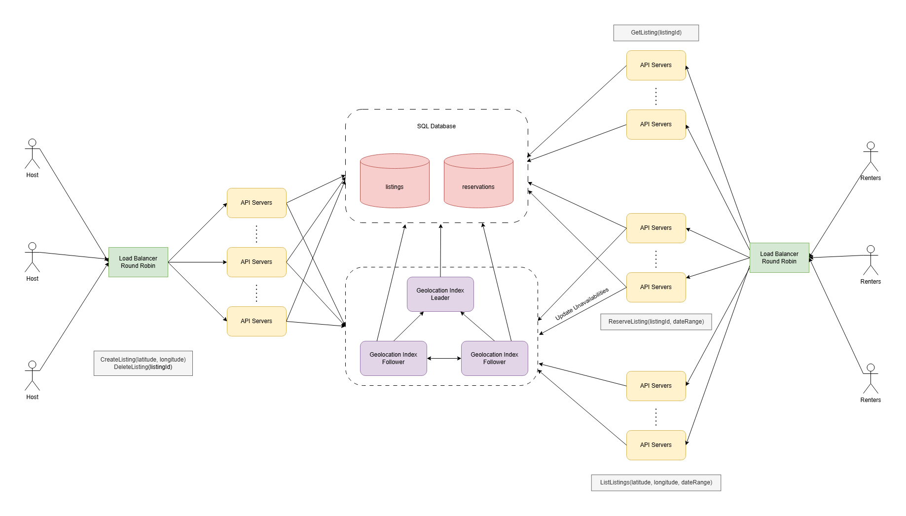

# Design Airbnb
## Gathering System Requirements
The design will focus on the core aspects of Airbnb. This involves the possibility for hosts to create property listings and for renters to search for listings and book them.

The system will support these features:
- Host Side: create and delete listings
- Renter Side: search for listings, getting an individual one and reserving it.

From the UI perspective, when a user presses the **Book Now** button, the listing should **reserve** for a period of time. During this period of time, the renters won't be able to see the listings or even search for it.

The system won't support what happens after the reservation is made. The only functionality supported in this regard will be:
- Cancelling the reservation if 15 minutes has passed and the booking process has not been completed yet
- Making the reservation permanent

When it comes to listing, the only two variables that the design will take into account will be:
- Location
- Available Range

The other variables of a listing won't be taken into account. These are characteristics such as price, amenities, parking, etc.. .

Latency is something to take into consideration when searching for listings, and when creating new listings as well.

The system will be designed to have a 50 million user base from U.S, with 1 million listings available at real-time.

## Design Plan
The design will be divided into two sections:
- The Host
- The Renter

And the renter can be divided even further into:
- Searching listings
- Getting a single listing
- Reserving a listing

## Listings Storage & Quadtree
The system will store all the listings on a SQL table, which will be the primary source of truth when a host creates or deletes a listing. 

Because latency is a concern when searching for listings, and it requires querying the database based on location, each region will have it's listings divided on a quadtree. This way, users can traverse it on it's entirety without limiting the searching scope if they were to search for a broader location.

The quadtree will be stored in memory on an auxiliary machine to reduce latency. This auxiliary machine will be called **the geo index**. It will store the information needed to display the listing on the UI:
- Title
- Description
- Link to the listing image
- Unique listing ID
- Etc.

Taking into account that as an upper bound, a single listing would take around 10KB in memory, then:
```
~10KB for each listing
~1 Million listings
~10KB * 1.000.000 = 10GB
```

And 10GB can be stored in memory.

To make sure that the quadtree never goes down due to machine failure, the system will have a cluster of machines each holding a copy of the quadtree. The cluster will then use the **leader election** strategy as a safety layer from machine failures.

The system will create the quadtree on boot up on the **geo-index machines** by querying the SQL table. When there is a new listing, or an old one gets deleted, the system will first write to the database table, and synchronously update the geo-index leader quadtree. Then, every 10 minutes, the leader and the followers of the geo-index machines will recreate the quadtree directly from the SQL table to stay up to date.

On this way, if one of the followers takes place when the leader dies, the information would be stale for at most 10 minutes. After which, the new quadtree is being generated.

## Searching For Listings
Renters will call to the **ListListing API** endpoint. The endpoint will then browse through the leader quadtree to find listings relevant to the renters specified location.

The quadtree will have a depth of approximately 10, since 4^10 > 1.000.000. This means that finding locations would be fast.

It's important to note that the system should not return listings which are unavailable during the date range established by the renter. For this, each listing will have a list of **unavailable date ranges** in which a binary search should determine if the listing is or not available for the renter to search for.

As the UI will be paginated, the system will limit the amount of relevant listings returned from the quadtree with an offset. If the page were to have a size of 50 listings, then the first offset is 0, the second is 50, third 100 and so on.

## Getting Individual Listings
This will be a simple API endpoint which will take the unique ID of the listing selected by the renter from the list of listings. Then the app will query the SQL table for the given ID of the listing.

As the listings are indexed by ID, this should not carry noticeable latency.

## Reserving Listings
When reserving listings, we need the reserved listing to be reflected on the quadtree and the persistent storage solution. 

A second SQL table called **reservations** will hold the listings IDs, date ranges and timestamps for each of the reservations. 

When a renter wants to book a listing, the **reservations** table will be queried to see if the listing for the specified range is still available. Otherwise, it will just return an error. If there is not a reservation made, then the system will give the host 15 minutes to finish the reservation and complete the payment.

To make sure that the quadtree is also up-to-date, when writing to the **reservations** table, the geo-index of the leader quadtree will also be updated. The reservation will have an **unavailabilities** list, in which each item has a date range and an expiration date.

The final JSON for the listing on the quadtree will looks like this:
```
{
  "unavailabilities": [
    {
      "range": ["2024-12-12T12:00:00-05:00", "2024-12-21T12:00:00-05:00"],
      "expiration": "2024-12-18T12:00:00-05:00"
    },
    {
      "range": ["2025-01-01T12:00:00-05:00", "2025-01-21T12:00:00-05:00"],
      "expiration": "2025-01-12T12:00:00-05:00"
    },
    {
      "range": ["2025-03-05T12:00:00-05:00", "2025-04-05T12:00:00-05:00"],
      "expiration": null
    },
  ],
  "title": "Listing Title",
  "description": "Listing Description",
  "thumbnailUrl": "Listing Thumbnail URL"
  "id": "Listing ID"
}
```
## Load Balancing
A simple round-robin approach will be enough to load-balance API requests from the host side. This includes creating and deleting listings. Then the API servers will write to the SQL table and communicate with the geo-index leader.

On the other side, from the renters side, the load balance will be used to list, get and reserve listings on a cluster of API servers. The strategy that will be used is called **API-path-based**, in which it the load balancer will route the API call depending on the endpoint that is trying to access.

In this way, the different API servers from the cluster can perform an specific task instead of trying to perform every different API call, decreasing latency. If other strategy were to be used, as the API workloads are very different from one another, it would increase latency.

Caching won't be done on the API servers, because it will cause the system problems regarding stale data such as:
- Reservations
- Bookings
- New Listings Appearing

## System Diagram

