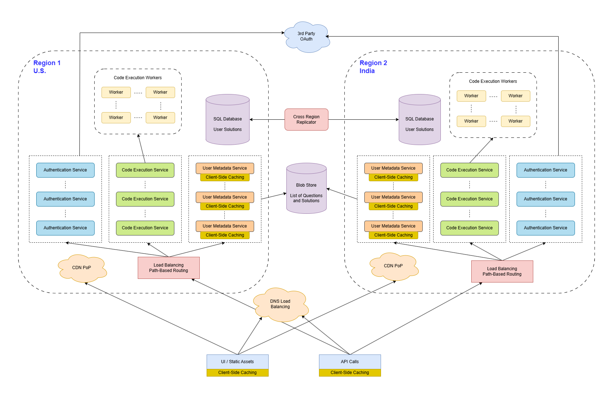

# Design AlgoExpert
## Gathering System Requirements
We are building the AlgoExpert user flow. This includes:
- Users landing on the website
- Accessing questions
- Marking questions as complete
- Writing code
- Running code
- Having the user's code saved

The answer will not make focus on the payments or authentication. And it won't go too deep into the code-execution engine.

The platform is built for a global audience. But there is a heavy emphasis on US and India, as it is where most of the users are from.

The system availability doesn't need to be overly optimized, as it is a paid product, there isn't the need for more than 2 or 3 nines. This means that in a whole year, there is **1% to 0.1%** of downtime. Which results in **8 hours and 3 days** of downtime per year.

Latency and throughput is something that the system needs to prioritize, since users will expect a fast response when running the code. And they will have their code saved up on the servers. Apart from the code-execution engine, this is not difficult to implement.

## Coming Up With A Plan
AlgoExpert has a lot of static content. For example, the home page is static with lots of images. On the other hand, there is a lot of dynamic content. For example, the code that users themselves can write.

This means that a robust API backing the UI is a must have. And given that the content generated by users gets stored on the website, there is the need for a robust database backing the API as well.

The entire system can be divided into 3 core components:
- Static UI Content
- Accessing and interacting with questions (This means saving solutions, questions completion status, etc.)
- Ability to run code

The second bullet point will get divided further.

## Static UI Content
There will be public assets such as images and JavaScript bundles stored in a blob store. We can use Amazon S3 or Google Cloud Storage (GCS) for that matter.

Since the audience of the website is global, and the main focus is to have a responsive site, a **Content Delivery Network** (CDN) will be necessary. This is crucial on mobile devices, since the internet connection tend to be slower than on Desktop.

## Main Clusters And Load Balancing
The main 2 regions that visit the AlgoExpert.io website are **U.S. and India**. Therefore, it's a must to have the 2 primary clusters of servers located on those regions.

The system can implement DNS load balancing to route API requests to a cluster closest to the user that's fetching the request. Within a region, they system could have **path-based load balancing** to separate the different services such as:
- Payments
- Authentication
- Code execution

This means that a single request could take different paths, even on the same server, depending on what's the main purpose of that request. And comes especially in handy when running the code execution engine, since it will run different kinds of servers in comparison to the rest of the API.

Each service will have a set of servers, and some round-robin load balancing could be implemented. This will be managed in the **path-based** load balancing layer.

## Static API Content
All the static content on AlgoExpert can be stored on a blob storage. Content such as the list of questions and their solutions can be requested through the API, but it's still static content.

The solution of a blob storage is due to simplicity.

## Caching
Caching needs to be implemented to improve the user experience of the website, by reducing load times. To implement it, we can set up 2 layers of caching for the static API content:
- **Client-Side Caching**: it will make users load questions once per session. Which will reduce the load times on the site and reduce the workload on the backend servers, since it will save 2-3 networks calls per session on average.
- **In-Memory Caching**: This will happen on the servers.
  - We can estimate **100 questions, with 10 different languages and 5KB for each solution** to be 100 * 10 * 5000 bytes = **5MB of total data to keep in memory** on average.
  - This is a perfectly fine size of data to keep in memory on a server.

Since the static API content will suffer from changes every few days, we want those changes to be reflected on production as fast as possible. In order to achieve it, the data can be invalidated, evicted and replaced in the server-side cache every 30 minutes.

## Access Control
In AlgoExpert, this regards to the **questions** content. Users who haven't purchased AlgoExpert won't have  access to individual questions.

To implement this, an internal API can be called when a user makes a request for the static API content. In that way, the system can figure out if the user owns the product before returning the full list of questions.

## User Data Storage
As we want to store user's solutions and completion status, we will need SQL tables for that matter. An SQL table like Postgres or MySQL seems like a good choice since we will need to query this data a lot. We need 2 tables, **question_completion_status** and **user_solutions**.

The **question_completion_status** will have the following schema:
- id: integer, (Primary Key, Auto-Incremented)
- user_id: string, (Can be obtained from auth)
- question_id: string,
- completion_status: enum('pending', 'attempted','solved')

The table could have implemented **Uniqueness Constraint** on the user_id and question_id pair. As well as an index on **user_id** for fast querying.

The **user_solutions** table will have the following schema:
- id: integer, (Primary Key, Auto-Incremented)
- user_id: string, (Can be obtained from auth)
- question_id: string,
- language: string, (The language of the solution)
- solution: string (The user's solution itself)

The table could implement **Uniqueness Constraint** on the user_id, question_id and language pair. As  well as an index on **question_id**. If lots of different languages that gets implemented, then an index on **language** as well is not a bad idea. Since that UI won't need to fetch all the user's solutions at the same time, which could cause problems on slow data connections.

## Storage Performance

## Inter-Region Replication

## Code Execution

## System Diagram
