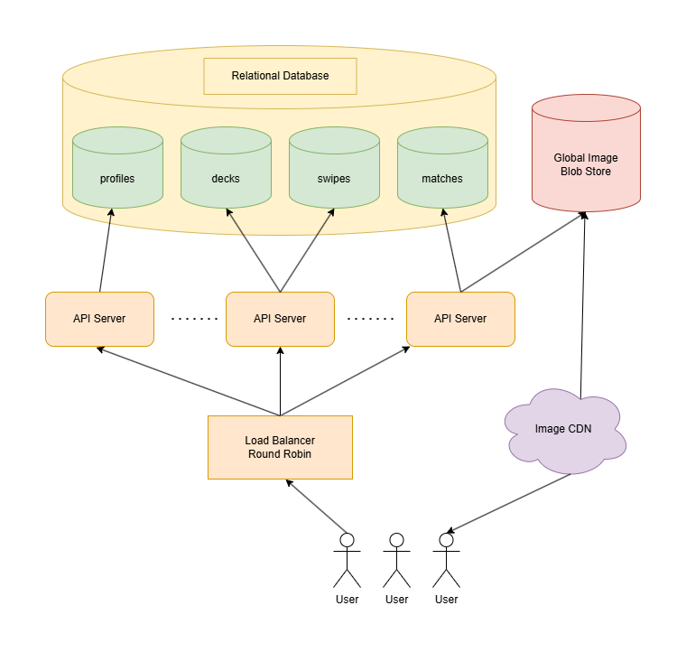

 # Design Tinder
## System Requirements
The design is going to involve the core system behind Tinder. This means allowing users to create a profile and swipe through an infinite deck of potential matches. Users can also do super-like matches, and undo their most recent left swipe.

Users won't have any limitations on the number of swipes, Super likes and undo they can do per day.

The design is not going to involve any functionality after two users match. Which includes any notification system, to let users know when they have matched. This is not the case however, when they are swiping right actively on the app. 

The system is estimated to serve 50 million users globally, evenly distributed around the globe. These users would like to have instant swipes, with latency when: 
- The user first loads the app 
- When the user has already swiped on a large amount of users

The availability of the system won't be the focus on this design.

## Design Plan
The 4 main sections that the design will focus on are:
- Storage Overview
- Profile Creation
  - Picture
  - Bio
  - Name
  - Etc.
- Deck Generation
  - Any other use on the platform which are within the distance and preferences of the person swiping
- Swiping
  - Left: Disliking or passing the user
  - Right: Like the user
  - If two users swipe right on each other, they can match
  - Once matched, the two users can chat and have an open line of communication.
- Super-Liking
  - Special type of swipe, in which you put yourself at the top of the person's deck who is swipping your profile.
  - If you are user 1 and Super-like user 2, user 2 will see user 1 at the top of his deck.
  - Plus there is a visual indicator that user 1 has **Super-Liked** user 2.
- Undoing
  - Undo the previous swipe that you did.
  - For the sake of simplicity, the design only includes undoing left swipes.
  - You cannot spam undo swipes. The user cannot undo more than 2 swipes on a row.
  - If the user swipes left, then right, it cannot undo the first left swipe anymore.
  - It just works with the left swipe that happened right before.

The **matching** and the **open line of communication** will not be covered on this design.

There are no caps on the potential matches, Super-likes, swipes for simplicity.

## Storage Overview
Except for the profile images, the data that we store like:
- Profile info
- Decks
- Swipes
- Matches

should be structured. The system will use a SQL database for that matter, which will be divided into several SQL tables.

There will be multiple regional databases to store all the data, which will be located in different hot spots such as India or East Coast U.S. Users who fetch the app, will be routed to the regional database which is closer to it's location by API servers. These API servers will redirect the traffic by a round-robin approach.

The profile images will be stored in a global blob store, and will be served through a CDN.

The system will have asynchronous replication implemented for the regional databases. But it would replicate every few minutes to hours. This is acceptable on this design, because users tend to be closer to each other in regards to geo location.

## Profile Creation
The user profiles will be stored in the **profiles** SQL table. The schema is the following:
- userId: string
- geolocation: point
- name: string
- age: int
- gender: enum
- sexualPreference: enum
- job: string
- bio: string
- pictures: string[]

The **pictures** column will store the addresses of the pictures which are stored in a separated blob store.

The **userId** is a field that gets automatically assigned to the user the profile gets created or updated. The **geolocation** field can be updated when the user opens the app. It will update the value of the field if the user is on a different location than it's previous stored location.

All this data takes around ~2KB per profile as an upper bound. We have estimated that tinder has 50 million users world wide. Therefore, the system will need 2KB * 50.000.000 == 100GB of storage per region. As we estiate to have 10-50 regional databases, the system will need 100GB * 10-50 == 1-5TB in total.

1-5TB is a very logical and manageable space for an app of this scale.

In regards to pictures, users will have an average of 5 pictures. This makes up for an upper bound of ~2MB per picture assuming that they are in 1920x1080p. Since users are going to see those pictures on a mobile device, we can reduce the dimensions of the pictures. To achieve this, we can implement lossy compression on each of the pictures.

By implementing lossy compression, the size of the pictures will be reduced to ~50KB on average. This is due to ~200-500KB after dimension reduction and ~50KB after lossy compression for each picture.

```
~50KB * 5 = 250KB for the pictures for each user
~250KB * 50.000.000 users == 12.5TB
```

12.5TB will be the total storage needed for the global blob store.

## Deck Generation
To generate the decks, the **smart deck-generation algorithm** will continuously generate 200 decks for each user every day. This is necessary to ensure the user's decks are as relevant as possible when they use the app. This will also minimize the possibility of the user getting irrelevant profiles in it's deck in case the user is travelling to another location.

The **deck-generation algorithm** to avoid re-generating decks for users who didn't use the app for more than a day. And can also be called to re-generate decks of people who have changed location, even in the same day. This is triggered when the user opens the app and the location stored in the **profiles** table row is different from what his/her device is registering. 

The decks for each user will be stored on an individual SQL table called **decks**. It will follow this schema:
- userId: string
- potentialMatches: string[]

The **potentialMathes** array will work as a queue. When the app loads, it will request the top 40 profiles from the **decks** table by the **userId** and store those profiles locally on the user's device. Then it will remove those users from the **decks** table. 

If the user shuts down the phone completely or closes the app, the profiles which were locally stored on the user's phone will be re-added to the deck at a later time by the deck-generation algorithm.

The app will make sure that the number of relevant profiles cached on the device is never less than 20. This is done to achieve the feeling of an infinite amount of swipes from the user's perspective. To accomplish this, the app will continuously fetch 20 additional profiles at the top of the user's deck when there are 20 profiles locally stored which has not been swiped yet.

When the user runs of potential matches, which means the deck has gone from 200 to 0, the request for 20 new potential matches will trigger the deck-generation algorithm to create a new deck. This will cause some potential loading time in the middle of using the app, but this is the only time in the entire UX that happens. 

As well as, the user would need to swipe for more than 200 potential matches during a single day extremely fast to get to it's final 20 before the app generates a new deck.

## Swiping

## Super-Liking

## Undoing

## System Diagram
