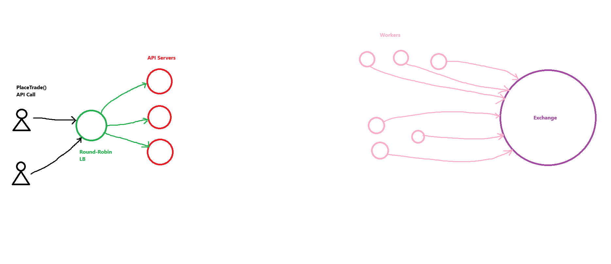

# Design A Stockbroker
## System Requirements
This would be a platform like Robinhood, or TD Ameritrade Website.

This design would include only:
- Market orders on stocks (current price)
- The Place Trade API call and the response receive from it.
- SQL Table for customers balances
- Millions of customers
- Only on US
- Millions of trades / day
- High Availability (HA)
- The clients would be either mobile app or web app
- Callback function
  - To the Exchange's API
  - On Complete Trade Callback

This means that if a client makes a place order (buying or selling an stock) with the broker platform (website), the exchange needs to execute it as soon as possible. This is the case, regardless of the stock price.

There isn't any margin system either. So, the account balance is the source of truth for each client.

The system won't cover downloading documents, depositing funds, withrawing funds, etc. Just the core trading function of the platform.

The designs assumes that the customer has already deposited funds on the platform. And there is a SQL Table with the balance for each customer.

The platform is an intermediary between end users, and a central exchange. This means that the platform API would be exchanging information with the central exchange API.
- This API would take a callback function, in addtion to the info of the trade
- The callback would be executed when the trade completes on the exchange level. Either when the trade gets fulfilled or rejected.
- The exchange API also has HA. Meaning that it will always be executed once
- The callback is kind of a notification when the state of the trade changes

## Design Plan
We can design it on 3 or 4 steps, or categories:
1. Think what the API of the broker would look like. This means the signature of the inputs and outputs of the API Call
2. What the backend servers are going to look like. This means the servers that handles the Place Trade API Calls
3. The design for the part of the system that handles and executes trades. Which is the part of the system that communicates with the exchange

## API Call
When a client goes on the website / app, the need:
1. Pick the actual stock (Name of the stock)
2. Define if they want to buy or sell the stock (Type of the order)
3. Quantity, because one can buy or sell multiple stocks (Quantity of the stock)
4. The customer needs a registered account (A customerId)

The API could look like the following:
#### Trade:
- orderId: uuid,
- stockTicker: string,
- type: enum: ["buy", "sell"],
- quantity: integer,
- status: enum: ["placed", "executed", "filled", "rejected"],
- reason: string,
- createdAt: date

#### Trades:
- PlaceTrade(customerId: uuid, stockTicker: string, type: enum: ["buy", "sell"], quantity: integer) => Trade

The customerId is generated by authentication by the client, done securely.

The system doesn't conceives getting trade statuses or order statuses. Or even list of statuses. But still we want some kid of authentification for the order. Therefore, the function would return an struct, with the orderId.

The response also would have an status. Which represents an order that has been placed, but hasn't been executed or filled.

the "createdAt" property is the timestamp of when the order has been created.

## API Servers
All the API calls would modify the customer balance. In general terms:
- If a client sells an stock, it should increase the customer balance
- If a client buys an stock, it should decrease the customer balance

To complement the SQL Table for customer balances, the system would probably need to store the orders on SQL Table as well.

This makes the platform future proof, for adding functionality for listing trades and orders. That's why having all the trades and orders stored in a SQL table would make sense. 

The table could look like this:
### trades 
- id INT // Primary key, Auto Incremented Integer or randomly generated String
- customer_id UUID_VALUE (Index on this column)
- stock_ticker VARCHAR(6)
- type ENUM('buy', 'sell')
- quant INT
- status ENUM('placed', 'executed', 'filled', 'rejected')
- reason VARCHAR(100) // A human readable reason of why a trade was rejected or filled
- created_at DATE
- executed_at DATE

### balances
- id INT // Primary key, Auto Incremented Integer or randomly generated String
- customer_id UUID_VALUE
- amount FLOAT
- last_modified DATE


## Trade Execution
Placing trades is a very taxing operation to the machine, because of the amount that are being handled every second. 

The server doesn't need any type of caching. Because it follows a Queue / FIFO structure, in which the firt trade that gets in is also the first that gets out and executed.

The Load Balancer (LB) could use a Round Robin approach. Because we don't care which client's request gets forwarded to which server.

The only two important things when executing a trade are:
- The customer has enough money on the exchange
- The orders gets forwarded in order, because the market orders get executed regardless of the price

The tables gets updated after the API has already talked to the exchange.

As the API Servers handle too much operations, we would need to add another layer of servers to making the API Request on itself. These would be called "Workers". 

The "Workers" would make: 
- Calls to the API of the exchange,
- Wait for responses from it,
- Update the SQL Tables

The cluster of workers is necessary for the HA aspect.

As we are using a Round-Robin LB Approach, there could be 2 different servers with trades from the same customer. This could get out of hand very quickly. Because two or more servers could try to make updates to the same customer registry at the same time.

This problem could be solved by using a "Publish / Subscribe Messaging System" in which specific trades by an specific customer / specific customers would be routed to a Messaging Service. For instance, at a special topic or channel for the customer or a set of customers. In which, the same customer would always be routed to the same topic.

The Workers Servers would then:
1. Subscribe to those topics / channels
2. Watch for new trades or notifications, or messages coming in
3. Grab the messages off the message queues
4. Then talking to the exchange

In that way, each specific customer / set of customers are channeled together. Avoiding making changes to a single registry from multiple servers at the same time. Additionally, once-delivery gets guaranteed never losing a trade.

## System Details
To create this system, we could use a service like Kafka or Google Cloud Pub/Sub. 

To make sure of the stickiness on the LB, we would hash the client by it's ID.

To avoid failure at the worker level, we could use leader election. Therefore, at any given point in time, one server is the leader. The leader takes care of the messages coming from the topic and the logic of contacting the exchange. To start, 3 workers is enough. Then it can be expanded. 5 workers would also make sense.

Each cluster would subscribe to one topic. 

Let's say that an hour has 4000 Seconds (Rough numbers, in reality is 3600 Seconds). Then lets suppose we have 25 Hours in a day. Then 4000 * 25 == 100.000 Seconds in a day. As we have 1.000.000 Trades in a day, we end up having 1.000.000 / 100.000 == 10 Trades / Second.

As we can only trade on Trading Hours, the trades are bunch up in a part of the day. Lets say that we have then 30 Trades / Second, only taking into account trades on Trading Hours (1/3 of the day, and no weekends).

Ideally then, we would have 30 Clusters Of Workers or more. So that, each one needs to handle less than 1 trade a second. For example, 100 Clusters and a 100 Topics would be reasonable.

The Clusters of servers are also horizontally scalable. And the Workers themselves are vertically scalable. And at the end, the system is dependant of the exchange API and how fast it responds.

## Logic At The Exchange Level
When a trade has been executed by a client, we have stored it on the trades table. And the status changed to "placed".

Then a Pub / Sub Message has been created. Which got routed to a topic. The leader of the worker servers, given the next message of the topic, decides what to do.

The message contains only the "customer_id". And by querying the database, the workers gets the least recent trade for the customer from the "trades" table. Depending on the status of that trade, the leader would go to the exchange or do nothing.
- If the least recent trade is not "filled" or "rejected", then the new trade goes to the exchange
- This means that the cluster would search for trades that are "placed" or "executed"

On the exchange, the system would wait until the exchange has a response for the trade which are "placed". But if the least recent trade has been "executed", then the new trade gets "placed".

SQL Query of the least recent trade:
```SQL
SELECT * FROM trades WHERE customer_id = 'c1' AND (status = 'placed' OR status = 'executed') ORDER BY created_at ASC LIMIT 1;
```

If there is another trade from the specific Customer Id which is in 'placed' state. Then the API would make an API Call to the exchange's API and mark the status of the previous trade as 'executed'. The goal is to never have a trade to hang.

On the call to the API of the exchange, there will be a callback to the exchange that will be sent.
- This callback function would be in charge of updating the balances table and the trades table.
- It would be also in charge of marking the status of the trade as 'filled' or 'rejected'.
- The callback function is guaranteed to be called by the exchange.

Then the message can be marked as done. Meaning that it can be left out of the messaging topic.

If the status of the trade is 'executed', then the worker would make an API Request to the Exchange's API to see if the trade is still 'executed' and not in 'filled' or 'rejected' state. If that's the case, then it would just wait. Then eventually, the trade would be modified by the callback function, changing the status from 'executed' to either 'filler' or 'rejected'.
- The same would happen by trades that are 'placed'. They would change to 'executed' instead by the callback function.

## The Callback Function
The Exchange would call the callback function when the trade completes. If the order gets 'filled', the exchange's API would make a request to either a worker server, or a separate server. This request would query or write to the "balances" and the "trades" tables.
- It would update the "state", and the "reason" of the trade on the "trades" table.
- It would update the "balance" for the "customer_id" on the "balances" table.

This logic should not be executed more than once by any means. Therefore, there must be an "if statement" in which rollbacks the transaction if the trade has already been completed. Updating the customer balance is not an idempotent operation, and should be treated as such.

The callback would then:
- If the trade is a buy order, would deduct the balance from the "customer_id"
```SQL
UPDATE balances (amount) SET ... WHERE customer_id = 'c1';
```
- Then would change the status of the trade, to 'filled'. It would also modify the "reason", which is equal for every "filled" trade, and the "executed_at" which would be given by the exchange at the time of execution
```SQL
UPDATE trades (status, reason, executed_at) SET status = 'filled', reason = 'Trade Completed', executed_at = GETDATE() WHERE id = ...;
```

If dealing with a rejected order, then the update balance query would not happen. But it would still update the "status" to 'rejected'. The trade "reason" to the reason why it was rejected. And would still call the "GETDATE()" function on the "executed_at" column.

After the queries has been fulfilled, the server updating the tables would return a 200 message to the Exchange's API. 

