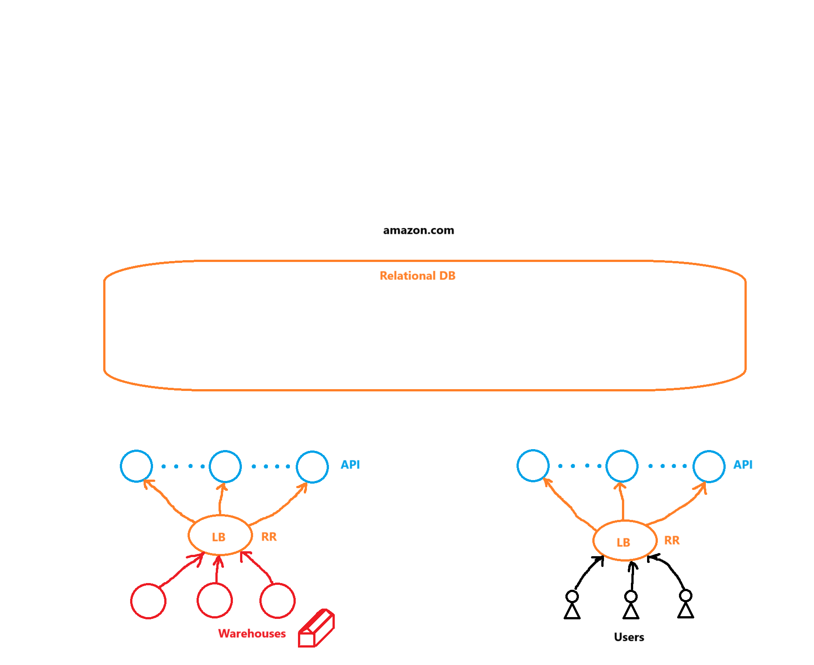

# Design Amazon
## System Requirements
The system would include the e-commerce business of Amazon. It is left out of scope "Amazon Web Services" or any other Amazon product.

Main parts of the design:
- Search (*Service*)
- Items ( Individual items or the search result. **Stock** amounts as well )
- Cart
- Checkout ( **Reserve** )
- Orders ( Submit and cancel ) ( *Service* )
- Warehouses ( **Stock** )
- amazon.com
- Focus core functionality
- 10 Orders per second

These are the elements of a system. However, the scope of the question doesn't includes:
- Homepage, we are just assume that is just a search box for people to type in
- Multiple carts are also out of scope. A single cart per user is enough.
- Neither the recommendation engine subsystem, that involves lots of machine learning
  - It would be assumed to have a search result recommendation engine service out of the box, that has been created for Amazon.
  - We only need to figure out where the subsystem is going to live on the greater system

The stock of items needs to be handled:
- Users cannot consume things out of stock
- The stock needs to decrease every time a purchase gets made

If there are two or more users watching at the same item, and there is low stock (1 or 2 remaining). As this is a complex problem to solve. Every user can see the item and how much is left. And any user can also add it to the cart, if the item is still on stock. Once beginning the checkout, the user would be alerted if the item is not in stock anymore.

If the item is still on stock, the system would reserve it for the user for 10 minutes or the duration of the checkout process (which can be capped at 10 minutes).

The system would include what happens when orders are assigned to an specific amazon warehouse. This involes the case when having an order in which items are located at different warehouses. In this case, the order needs to be split up and the customer ends up receiving two packages instead of only one. 

This means that the system needs to solve how stock comes into place when it comes to the warehouses and delivery aspects. However, all of which is referred to delivery drivers and deliveries can be ignored.
- The system doesn't care about if there are multiple warehouses that can fulfill the order
- The only thing that we care about is the warehouses and the stock.

For making the selection of warehouse, we can just rely on a separated service. This service would be called the "Order Assignment Service" which is smart enough to figure out:
- How to split orders into sub-orders for warehouses
- Which warehouses do we need to assign the orders to

The system also lets out of question "Amazon Prime" or "Amazon Subscription Services".

Even if amazon has a lots of websites and businesses, like "amazon.com", "amazon.fr", "amazon.in", etc. For the scope of the design, all the regional businesses (amazon.fr for France or amazon.in for India) are entirely separate but identical businesses.

This means that we are just designing "amazon.com" and the design would be applicable to the rest of the regions. They would be identical.

In terms of latencies and availability, the system should be probably **Highly Available** and really **fast search queries** (Low latencies when seraching for items). Fast order submissions is not necessary.

We would be granted a HA SQL setup out of the box. Therefore, we don't need to worry about the HA setup. The focus is on:
- DB Schemas
- Core functionality
- And how everything connects together

Amazon has 300 M customers, and 60.000 orders per hour. Which is around 20 orders per second. And since our design is designed only for the US market in mind, then we rest with 10 orders per second. This is half of all global amazon orders. 

But the **focus** remains on the **core functionality** of the system, **more than** the **system characteristics** on itself.

## System's Design Plan
The core functionality is going to be split up into:
- Users
- Warehouses

And we can subdivide the system even more:
- Browsing items through a search query from the user
- Modifying the cart
- Starting the checkout process
- Submitting and cancelling orders

## High-Level System Overview
On a set region, Users and Warehouses are going to make request to a Load Balancer (LB) with a Round-Robin technique. The LB would then redirect the request to a set of API servers. And the data would be writen to and read from the SQL table on that specific region

The SQL table is preferred on this design, due to the natural structure of the data that we are dealing with. Whether it is:
- Items
- Carts
- Orders
- Etc..

Which lends itself on the relational DB model.

## SQL Tables
We would need the following tables to support the features required for the entire system:
### Orders
This table stores all the orders from Amazon. Each row represents an order.
```SQL
CREATE TABLE orders (
  orderId UUID PRIMARY KEY,
  customerId UUID,
  orderStatus ENUM('submitted', 'processing', 'shipped', 'delivered', 'canceled'),
  items JSON,
  price INT,
  paymentInfo JSON,
  shippingAddress VARCHAR(255),
  timestamp DATETIME,
  other JSON
);
```
The "items" column looks like:
```JSON
[
  {
    itemId: "aab5d5fd-70c1-11e5-a4fb-b026b977eb28",
    quantity: 3
  }, 
  {
    itemId: "3cc7f7dc-70c5-11e5-a4fb-b026b977eb28",
    quantity: 5
  },
  ...
]
```

### Aggregated Stock
The table will store the aggregated stock of the items available on Amazon. Each row represents an item. The stock amount for each item is aggregated sum from all Amazon warehouses.
```SQL
CREATE TABLE aggregated_stock (
  itemId UUID PRIMARY KEY,
  stock INT,
  FOREIGN KEY (itemId) REFERENCES items(itemId) ON DELETE CASCADE,
);
```

### Carts
The table stores all the carts for each user on Amazon. Each row represents a cart. For this exercise, each customer can only have one cart.
```SQL
CREATE TABLE carts (
  cartId UUID PRIMARY KEY,
  customerId UUID,
  items JSON,
);
```
The "items" column looks like:
```JSON
[
  {
    itemId: "aab5d5fd-70c1-11e5-a4fb-b026b977eb28",
    quantity: 3
  }, 
  {
    itemId: "3cc7f7dc-70c5-11e5-a4fb-b026b977eb28",
    quantity: 5
  },
  ...
]
```

### Items
The table will store all the items available on Amazon. Each row represents an item.
```SQL
CREATE TABLE items (
  itemId UUID PRIMARY KEY,
  name VARCHAR(255),
  description TEXT,
  price INT,
  currency ENUM('usd', 'eur', 'jpy', ...),
  other JSON
);
```

## Core User Functionality
The user will search for an item, with a search query. The servers will return the items taking into account the stock. Then the user will add items to the cart and start the checkout to submit the order.

With this in mind, the following are the endpoints for the APIs:
```javascript
getItemCatalog(search);
```
This method will fetch the API endpoint when the users are searching for items. The request will be routed by the API servers to the "smart search-results" auxiliary service. Which is an external server that:
- Interacts directly with the items table
- Caches item searches that are popular
  - The goal of the cache is to reduce latencies
  - It is based on the search query, the location, age and lots of other factors that fits best with the specific user persona
- Returns the results
- It also performs lots of logic to get the best items
  - These items will be the ones that fits the search query the most
  - There is probably some machine learning involved

This endpoint will also fetch the stocks of the selected items from the "aggregated_stock" table.

```javascript
updateCartItemQuantity(itemId, quantity);
```
This endpoint is called by users when adding or removing items from the cart. The requests directly write to the "carts" table. Users can only call the endpoint when there is enough stock in the "aggregated_stock" tables

```javascript
beginCheckout() & cancelCheckout()
```
These endpoints are called when the user begins or cancels the checkout process.

The "beginCheckout()" request calls for another read from the "aggregated_stock" table for the items on cart.
- If some of the items are not in stock anymore, the UI alerts the user
- If there are enough stock for all the items, the API servers would then write to the "aggregated_stock" table and decrease the requested quantity from the items on the cart.

The "cancelCheckout()" request writes to the "aggregated_stock" table increasing the stock of the items that has been canceled, effectively "unreserving" the items. It also gets triggered after 10 minutes of being in the checkout process

All the writes to the "aggregated_stock" table are ACID transactions (Atomicity, Consistency, Isolation, and Durability). Which means that transactions are happening one by one, and the stock will always be on a correct state. There isn't the case that two users are consuming the same quantity for stock.

```javascript
submitOrder(), cancelOrder(), & getMyOrders()
```
The "submitOrder()" request will go to the API servers and then to the DB. It will then empty the cart of the user from the "carts" table, and go to the "orders" table and write a new order.


