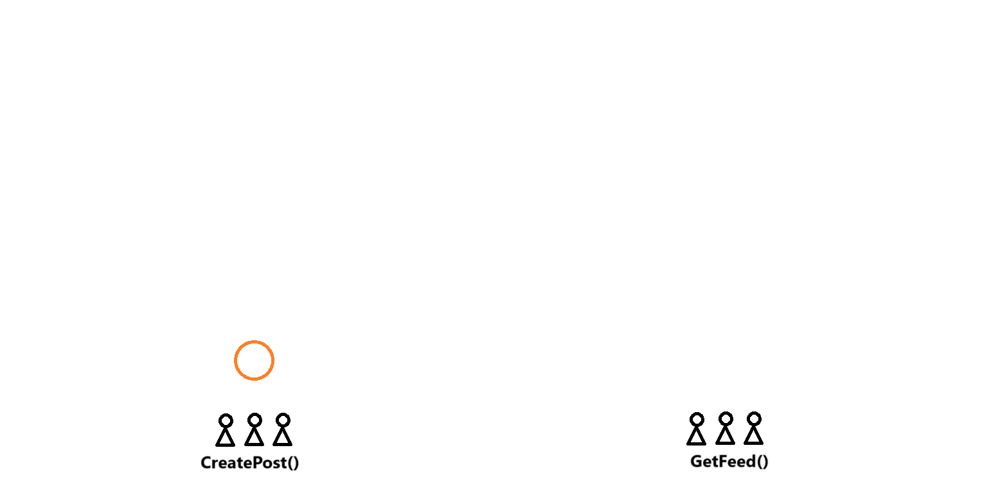

# Design Facebook News Feed
## Gathering System Requirements
This is a large feature, with sub-features or smaller components to it. As an user:
- You can load and see the news feed
- You can interact with the news feed
  - For example, liking or posting status updates
- Updating the news feed with post at real time

That is the focus of this design. Not what goes into a post or the API. Posts are going to be treated as opaque entities that we would want to store, but without worrying about the details of storage. 

Therefore, the system requirements are:
- Loading and Updating a news feed
- Posting, and how it affects the rest of the user's news feed
- Ranking algorithm is an external service. In which relevant posts can be feed in, and the service generates the news feed for you
- Ads of the new feed are a bonus part of the design. 
- Global user base
- 1 Billion users per day. Which adds up to 5 Billion news feed loads per day
- 10 Million news status posted every day
- 500 friends per user on average
- latency would be 1s to 1m, depending on how far people are.
- Posts should be persistent (no HA)

## Coming Up With A Plan
The system would be divided into two major subsections. There is an entire flow that starts on an user posting an status update, and there is the entire flow that starts at an user loading the news feed

The design stats at the extremity of the system and work inwards. First there will be an explanation of the two API calls (CreatePost and GetFeed). Then there will be an explanation of the feed creation and storage strategy, cross-region design and how the entire system ties together in a fast and scalable manner.

With the scale that the system is managing, the APIs needs to have a heavy load-balancing implemented. 

## CreatePost() API
When calling the CreatePost() endpoint, the system would redirect the request to a Load Balancer (LB) or a cluster of LBs.

When creating a post, there isn't any caching or "server stickiness" necessary. Creating a post just means adding data to the database. This means that the LB servers could distribute the load in a Round-Robin approach.

For this design, the CreatePost API call could simply look like:
```
CreatePost(
  user_id: string,
  post: data
)
```
## Post Storage
There will be a main relational database, to store most of the system data. This includes post and users. The database will have very large tables

## GetNewsFeed() API
This GetNewsFeed() API call looks like this:
```
GetNewsFeed(
  user_id: string,
  pageSize: integer,
  nextPageToken: integer,
) => (
  posts: []{
    user_id: string,
    post_id: string,
    post: data,
  },
  nextPageToken: integer,
)
```

The **pageSize** and **nextPageToken** serve to paginate the newsfeed. This is necessary when dealing with huge amounts of data.

## Feed Creation And Storage
As Facebook serves 1 Billion users, which makes 10 million news status every day, the databases are going to be so large that fetching news feeds from the main DB when calling "GetNewsFeed()" isn't ideal:
- It would provoke very high latencies
- Sharding the main DB holding the posts isn't helpful neither because the different news feed would need to aggregate posts from different shards.

The last one can be solved by using "cross-shard joints" when generating news feed. This is not recommended due to increase on complexity, increased latency, etc.

Instead, the system can use an array of shards to store news feeds separately from the main database. 

The system can also have a separated cluster of machines acting as a proxy between the main DB and the shards. this proxy will be in charge of: 
- Aggregating posts
- Ranking them via the ranking algorithm
- Generating news feeds
- Sending them to the shards every set amount of time (5, 10, 60 minutes) which would depend on the update frequency of the newsfeed.

As we are assuming to have 1 Billion users at global scale, let's assume that per region there is 1/10 of that amount. We also know that each user loads the newsfeed 10 times per day on average. This means:
```
(100.000.000 Users per region * 10 Newsfeed loads) / 24 Hours ~= 416.666.666,667 Newsfeeds per hour
416.666.666,667 Newsfeeds per hour / 60 Minutes / 60 seconds ~= 10.000 Queries Per Second (QPS).
```

Let's assume that each post has an average size of 10 Kb, and each newsfeed aggregates the top 1000 posts most relevant to the user. This means that we need to store 10 Mb per user. Because we have 1 Billion users, we have 10.000 Tb = 10 Pb (Petabytes) of storage in total. We can use 1000 machines of 10 Tb each as the newsfeed shards.
```
~10 Kb per post
~1000 posts per news feed
~1 billion news feed
~10 Kb * 1000 * 1.000.000.000 = 10 Pb = 1000 * 10 Tb
```
The system can be sharded by user_id to distribute the newsfeed roughly evenly.

When there is a call to the GetNewsFeed(), it gets redirected by the load balancer to the right newsfeed shard. The newsfeed shard returns the correct data, reading it's local disk. If the newsfeed doesn't exists on the shard, then the shard reads from the source of truth (the main DB, through the ranking service proxy) to gather the relevant posts.
- This last section could increase latency.
- The goal is to avoid the scenario from happening.


