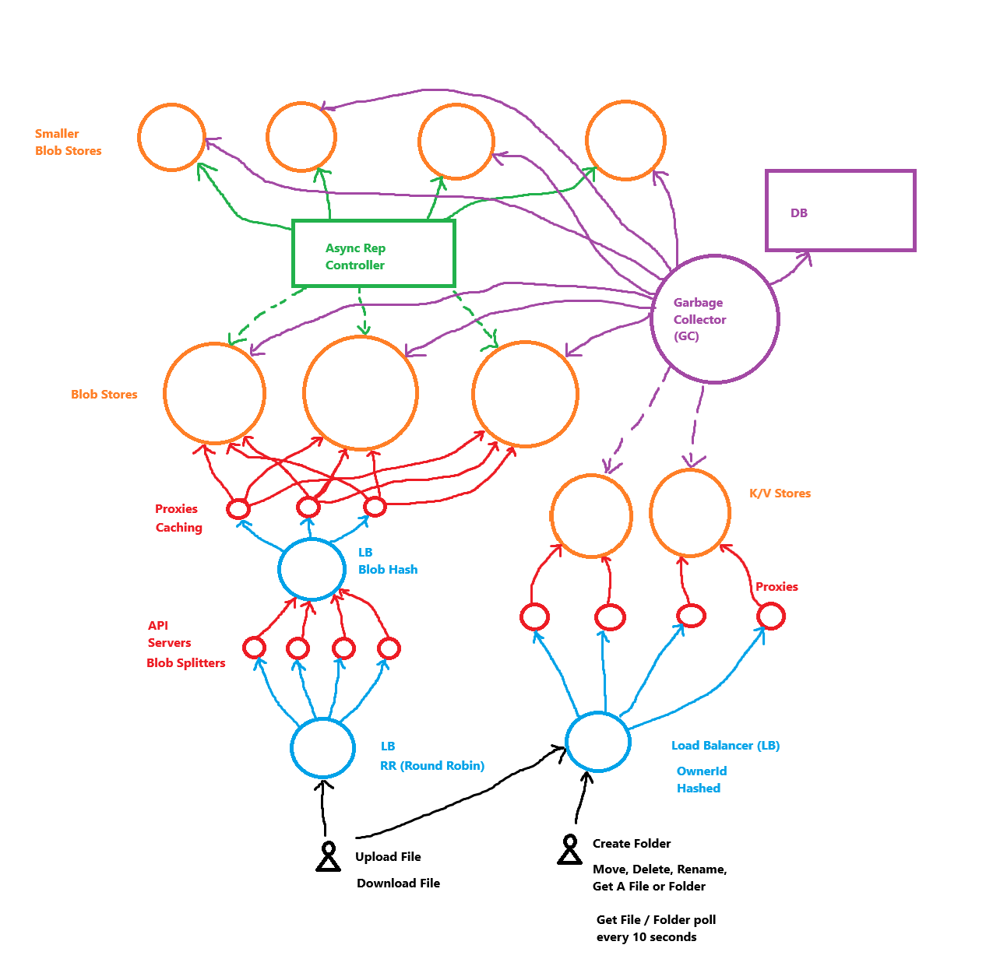

# What is the scope?
The scope of the design is limited to a personal account of gooogle drive, in which data can be stored. Things like:
- Docs
- Sheets
- Logs and most used docs
- Shared business accounts
- Sharing and permissions functionalities
- etc.
are out of the question.

The files and folders stored in google 

## Scope
- CRUD operations (Folders and Files), plus downloading files.
- Just Web, no desktop client
- 10s updates if there are multiple clients, with no conflicts between them (Two tabs accessing the same folder on a browser)
- 1B Global Users (15GB/User)
- No data loss (redundancy or duplication of the data)
- Highly Available

## CRUD Operations to be supported
- Create Folder
- Upload / Download File
- Move, Delete, Rename, Get file and folder

### Creating Entity
As we are designing Google Drive, we can use GCS (Google Cloud Storage) for the main blob storage service. For the metadata, or entity information, can be stored on a key-value store. Because these are configuration information about a particular file or entity.

When creating a file / folder, the system stores information on the K/V Store about that file / folder.

The K/V Stores needs to be HA (Highly Available) and be shared to serve that many users. 

As the entities needs to be available globaly all the time, sharding cannot be by region. Therefore, the system can be shard by the file or entity ID. But also by the owner ID.

As the K/V stores needs to be HA, we can use ETCD or ZooKeeper.

### Creating A Folder
When creating a folder, there is a need for load balancers. Since a single server cannot manage can't handle 1B users at the same time. Which is going to be based on the Owner ID. 
- The creation of a folder is managed by the Owner ID, since we want the owner of the folder be parented with the Owner of the folder.
- Let's say that the Owner is user1. Let's say that there is another user, user2, that is accessing the Google Drive of user1. Then the folder created will be still parented with user1.
- The Owner ID would be hashed

The K/V Stores could also implement Proxies for:
- Caching
- ACLs (Access Control Lists), which could do the checking if a user has permission to create a folder.

This means that creating a folder is just creating a new register on the K/V Store, with the following data structure:
```
{
  id:
  name:
  ownerId:
  children: []
  isFolder: true
}
```
### Uploading A File

1B = 1000^3.
(15GB * 1000)^3 = (15 TB) * 1000 * 1000 = 15 PB * 1000 = 15.000 PB.
Being TB = Terabytes and PB = Petabytes.

As there is a policy of no data loss. There is duplication implemented, and probably would be stored in different availability zones.

This is because if one data center is hit by a huge disaster or an outage, there is always one data center with the data still on it.

Let's say that we need 3 sources of truth for a single piece of data, then we would need 15.000 PB * 3 = 45.000 PB ~= 50.000 PB.

There are some optimizations to be made though. Imagine if two users upload exactly the same picture twice, then the picture could be stored only once per data center.
- Also the images or the data could be split up, so that if only part of the image is the same, this doesn't gets stored twice on google drive.
- This would require smaller blob storages.

The system then may be composed by multiple API Servers and a Load Balancer.

The Job of the API servers would be to split up the file into smaller pieces of data, with an algorithm.


